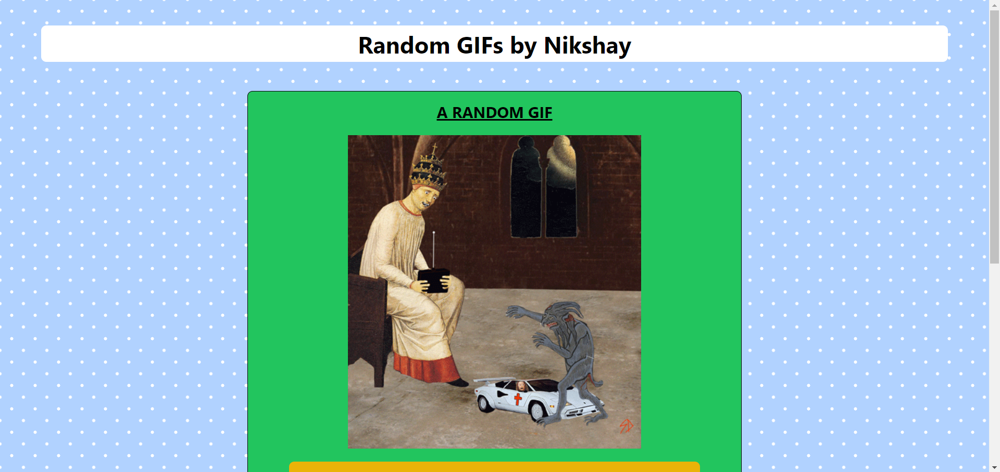
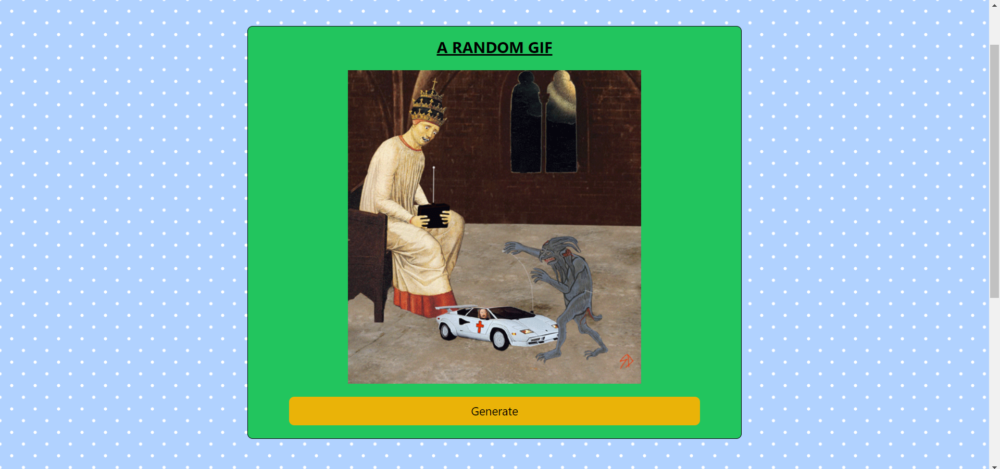
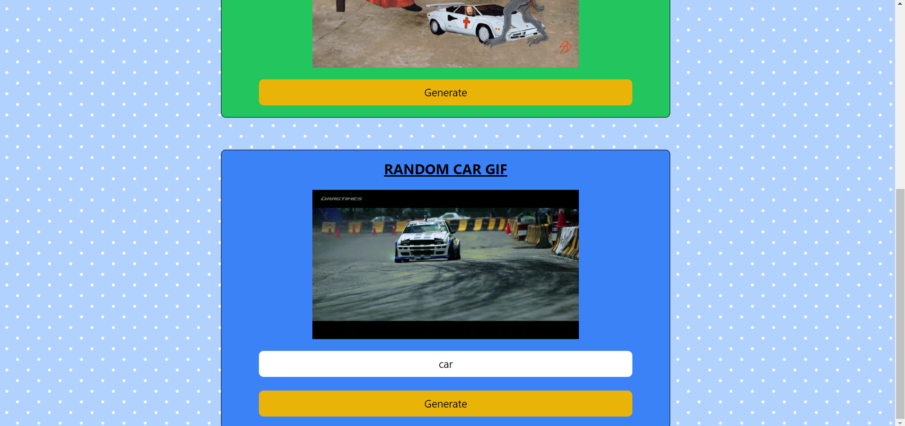

# Random GIF Generator

**Added custom hooks, Tailwind CSS styling. Generate random GIFs or search for GIFs.**

## Overview

This project is a simple React application that allows users to generate random GIFs using the Giphy API. It includes custom hooks for fetching data and Tailwind CSS for styling. Users can generate random GIFs by clicking a button.

## Features

- **Random GIFs**: Fetch and display random GIFs from the Giphy API.
- **Custom Hooks**: Utilizes custom hooks for fetching data.
- **Tailwind CSS**: Styled using Tailwind CSS for a clean and responsive design.

## Screenshots

### Landing Page

### Random GIF

### Tagged GIF Search

